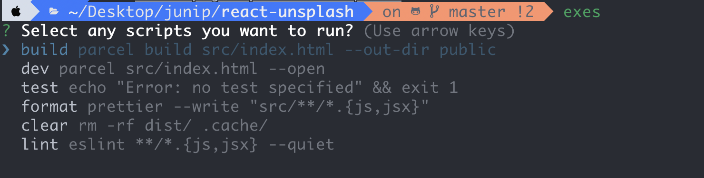

# exes

[]() []()

:star: If you are using this tool or you like it, Star on GitHub — it helps!

<<<<<<< HEAD
:rocket: A CLI tool that detects scripts from package.json and show in a selective prompt, 

:lipstick: it detect automatically the package manager and execute it accordingly. (i.e yarn or npm run)
=======
:rocket: A CLI tool that detects scripts from **package.json** and show in a prompt
>>>>>>> c3766fd53265620638579c774fc3fe95e045b760

:up: 


### Usages

- You need to execute the `exes` **command** in the respective directory

- it takes the available scripts from the **package.json** and show it in a prompt.

- if your executed directory doesnt contains the **package.json** it will return error.
## Prerequisites

You are required to have [Node.js](https://nodejs.org/) installed to run the cli tool or after installing [Node.js](https://nodejs.org/) you can make executable and run the excutable to use the tool. [Make executable](#making-executable)

## Install Using NPM

You can use directly install the package using 
[NPM](https://www.npmjs.com/package/exes)  or  [YARN](https://yarnpkg.com/en/package/exes)

```sh
 npm install -g exes
```
```   
 yarn add exes
```

### use the below command to get started

```sh
 npx exes
```

### By Cloning the repository

Install all dependency 


```sh
npm install 
```

### Create the symlink. This command will help you execute `exes` commands at global level 


```
npm link or sudo npm link
```


### Contribution

We hope that you will consider contributing to exes. Please read this short overview [Contribution Guidelines](https://github.com/junipdewan/exes/blob/master/CONTRIBUTING.md) for some information about how to get started 

### MIT License

**exes** is available under the **MIT license**. See the [LICENSE](https://github.com/junipdewan/exes/blob/master/LICENSE) file for more info.

Copyright (c) 2019 <junipd2@gmail.com>

:rocket: Happy Coding
